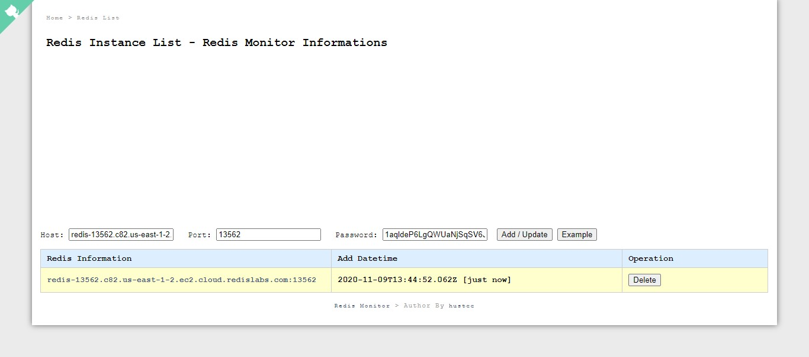

# NodeJS-Express-sqlite-Node-monitor

<h2>Redis-Monitor using Nodejs/Expressjs/Sequelizejs/sqlite3</h2>
 

<b>Note:</b>All the dependencies can be viewed in Package.JSON

<h2>How to run this Project</h2>
<h3>Project is hosted on heroku and can be accessed on <a href="https://redis-monitor-kritikal.herokuapp.com/">this </a>link</h3>

<b>Note:</b>You can create your own redis server at <a href ="https://redislabs.com/" >Redis Labs </a> 

For testing purpose following can be used(just copy and paste them) :

<ul>
  <li>host : redis-11580.c8.us-east-1-4.ec2.cloud.redislabs.com:11580 </li>
  <li>port : 11580 </li>
  <li>password : cTzZ6IYdN1ibqktiKPto2CkEWU3IiudD </li>
</ul>

<h3>To access project locally. Follow the following steps </h3>

<b>Note</b>Nodejs version 4 or above , npm and Redis must be installed on the computer

<ol>
  <li>Clone this repository</li>
  <li>In terminal: npm install </li>
  <li>npm start</li>
  <li>In the browser go to the following URL : 127.0.0.1:3000 {http://localhost:3000} </li>
</ol>

<h2>Following API has been used on the Backend side </h2>
<ol>
  <li>GET: /api/redis_list</li>
  <li>GET: /api/redis_info</li>
  <li>GET: /api/redis_monitor</li>
  <li>GET: /api/ping</li>
  <li>POST: /api/add</li>
  <li>POST: /api/del</li>
  <li>GET: /api/redis/flushall</li>
</ol>

<h2>Screenshots</h2>

